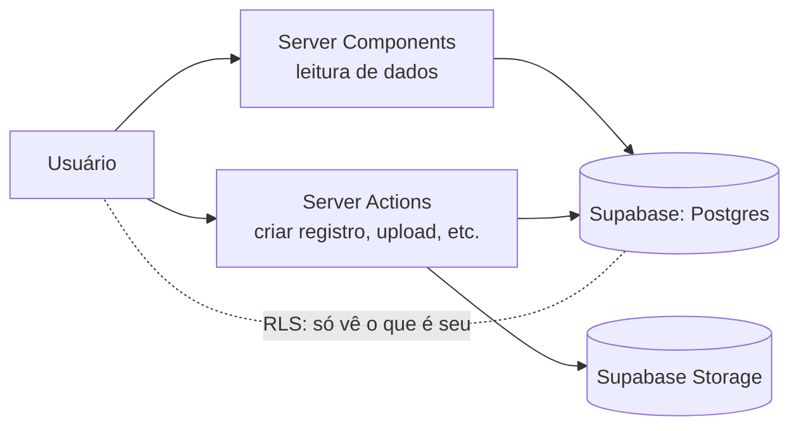
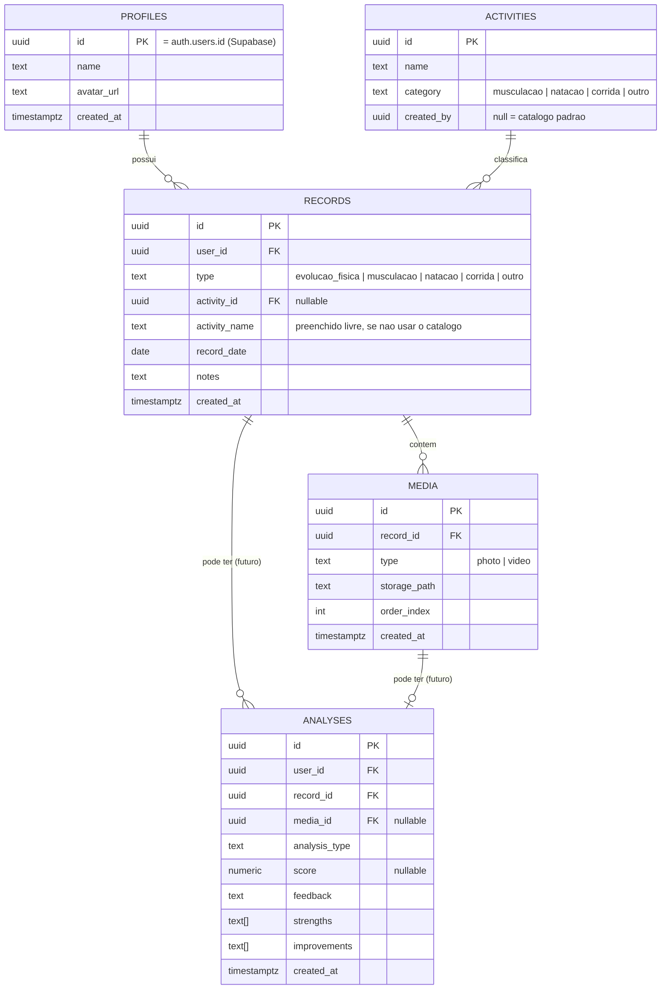

# EVOLUI — Arquitetura do MVP

> Documento de proposta. Nenhum código foi gerado ainda — o objetivo aqui é alinhar requisitos, stack, arquitetura, estrutura de pastas, modelo de dados e roadmap antes de começar a construir.

## 1. Análise de requisitos

### Requisitos funcionais do MVP

- Conta e autenticação: cadastro, login, perfil do usuário.
- Registro de conteúdo: upload de fotos e vídeos, associados a um tipo (evolução física, musculação, natação, corrida, outro), com data, nome da atividade e observações.
- Histórico: todos os registros organizados cronologicamente ("Minha Evolução"), com filtros por tipo de mídia/atividade.
- Detalhe do registro: visualizar um registro individual com sua mídia e informações.
- Comparação: selecionar dois registros e visualizá-los lado a lado (por enquanto, só visual — sem análise automática).
- Dashboard: visão rápida ao entrar (total de registros, último treino, última foto).

### Requisitos não funcionais

- **Simplicidade operacional**: sem microserviços, sem infraestrutura própria para gerenciar — um único deploy, um único banco.
- **Preparado para crescer**: a modelagem e os módulos já devem prever a camada de IA/visão computacional, sem implementá-la.
- **Mobile-first e responsivo**: a maior parte do uso (enviar foto/vídeo de treino) provavelmente acontece no celular.
- **Privacidade por padrão**: fotos e vídeos são conteúdo sensível — cada usuário só pode acessar o que é seu (isso vira um requisito direto de arquitetura, não só de produto).
- **Percepção de produto premium**: não pode parecer um painel administrativo genérico.

### Fora de escopo nesta fase (mas contemplado na arquitetura)

- Análise real por IA/visão computacional (postura, braçada, comparação automática).
- Peso e medidas corporais.
- Comparações salvas/persistidas (a comparação do MVP é uma seleção ad-hoc, não precisa de tabela própria ainda).
- Qualquer alegação clínica ou de precisão corporal — o produto é feedback informativo e comparativo, nunca diagnóstico. Isso afeta principalmente os textos da futura tela de análise (campo `feedback`), não a arquitetura em si, mas vale registrar aqui porque toda a tabela `analyses` foi desenhada em torno dessa regra.

## 2. Stack escolhida

| Camada | Escolha | Por quê |
|---|---|---|
| Frontend | Next.js (App Router) + TypeScript + Tailwind CSS | Você já pediu essa combinação; App Router permite Server Components (menos JS no cliente, bom para páginas com muita mídia) e Server Actions (mutações sem precisar montar uma API REST separada). |
| Componentes de UI | Tailwind + shadcn/ui | Componentes acessíveis e não-genéricos como ponto de partida — evita a "cara de painel administrativo" que você quer evitar, porque o visual final é definido no seu design system, não no componente pronto. |
| Backend | O próprio Next.js (Server Actions + Route Handlers quando necessário) | Não há necessidade de um backend separado para o volume de um MVP. Route Handlers ficam reservados para casos que exigem HTTP "de verdade" (ex.: um futuro webhook de um serviço de análise de vídeo assíncrono). |
| Banco de dados | PostgreSQL via **Supabase** | Você pediu Postgres; Supabase entrega Postgres gerenciado + Auth + Storage no mesmo projeto, o que elimina 2 integrações extras num MVP. Dá para migrar para um Postgres "puro" depois, se necessário — é Postgres padrão por baixo. |
| ORM | **Prisma** | Tipagem forte de ponta a ponta, migrations legíveis, Prisma Studio ajuda a inspecionar dados sem abrir o painel do Supabase. Alternativa viável: Drizzle (mais leve, mais próximo do SQL) — se performance/edge runtime se tornar prioridade depois, é a primeira troca a considerar. |
| Autenticação | **Supabase Auth** (e-mail/senha inicialmente; OAuth Google como próximo passo fácil) | Resolve sessão, verificação de e-mail e recuperação de senha sem código próprio, e já integra com Row Level Security do Postgres — a autorização "usuário só vê o que é seu" fica garantida no banco, não só na aplicação. |
| Storage (fotos/vídeos) | **Supabase Storage** | Buckets com políticas de acesso ligadas ao mesmo sistema de autenticação/RLS; upload direto do browser para o Storage (sem passar o arquivo pelo servidor Next.js), o que importa para vídeos, que podem ser grandes. |
| Deploy | Vercel (frontend/app) + Supabase Cloud (dados/auth/storage) | Combinação padrão para esse stack, sem servidor para administrar. |

**Sobre vídeo no MVP**: sem pipeline de transcodificação/thumbnail automática por enquanto. Aceitar formatos comuns (mp4/mov), com limite de tamanho (ex.: 100–200MB) validado no client e reforçado por política do bucket. Miniatura de vídeo pode ficar para uma etapa posterior (gerar a partir do primeiro frame) — no MVP, um vídeo pode ser representado por um player simples.

## 3. Arquitetura geral

**Monolito modular** — um único app Next.js, mas organizado em módulos de domínio para não virar uma pasta `components` com tudo misturado.

Padrão de fluxo de dados:



- **Leitura** (dashboard, timeline, detalhe de registro): Server Components buscando direto do Postgres via Prisma.
- **Escrita** (criar registro, subir mídia, editar perfil): Server Actions — sem precisar desenhar uma API REST à parte para o próprio frontend consumir.
- **Autorização**: Row Level Security no Postgres (cada linha de `records`/`media`/`analyses` só é visível para o `user_id` dono) + verificação de sessão no layout autenticado do Next.js. Isso significa que mesmo um erro de código no front não expõe dados de outro usuário — a regra vive no banco.
- **Upload de mídia**: o cliente pede uma URL assinada/política de upload ao Supabase Storage e envia o arquivo direto para lá; o Next.js só grava a referência (`storage_path`) no Postgres depois que o upload é confirmado. Isso evita que vídeos grandes passem pelo servidor da aplicação.

### Ponto de extensão para IA (sem implementar agora)

A ideia é que adicionar IA depois seja "plugar um serviço", não "redesenhar o sistema":

- `services/analysis/imageAnalysisService.ts` e `services/analysis/videoAnalysisService.ts` — hoje, interfaces com uma implementação `stub` que não faz nada (ou retorna "análise não disponível ainda"). Quando a IA real existir, a troca é só a implementação por trás da interface.
- A tabela `analyses` (seção 5) já existe desde o MVP, mesmo vazia — assim a tela de detalhe do registro já pode ter o "espaço reservado" para mostrar uma análise, sem precisar de migração de banco quando a IA chegar.
- O fluxo de comparação já compara dois registros/mídias lado a lado; adicionar uma "análise comparativa automática" depois é inserir um card de resultado nessa mesma tela, alimentado por `analyses`.

## 4. Estrutura de pastas

```
evolui/
├── app/
│   ├── (marketing)/
│   │   └── page.tsx                 # landing page
│   ├── (auth)/
│   │   ├── login/page.tsx
│   │   └── cadastro/page.tsx
│   ├── (app)/                       # área autenticada
│   │   ├── layout.tsx                # valida sessão, shell com navegação
│   │   ├── dashboard/page.tsx
│   │   ├── registros/
│   │   │   ├── novo/page.tsx
│   │   │   └── [id]/page.tsx         # detalhe de um registro
│   │   ├── evolucao/page.tsx         # timeline "Minha Evolução"
│   │   └── comparar/page.tsx
│   ├── api/                          # route handlers, só quando REST for necessário
│   └── layout.tsx
├── components/
│   ├── ui/                           # botões, cards, inputs (base shadcn)
│   └── layout/                       # header, navegação, shell autenticado
├── features/
│   ├── auth/                         # formulários e lógica de login/cadastro
│   ├── records/                      # criação, listagem, detalhe de registros
│   ├── media/                        # upload e exibição de fotos/vídeos
│   ├── timeline/                     # lógica da tela "Minha Evolução"
│   ├── comparison/                   # lógica da tela "Comparar"
│   └── analysis/                     # stubs/contratos para IA futura
├── services/
│   ├── supabase/                     # clients (browser/server), helpers de sessão
│   ├── storage/                      # upload, URLs assinadas
│   └── analysis/                     # imageAnalysisService, videoAnalysisService (stubs)
├── lib/
│   ├── db/                           # client Prisma
│   ├── validation/                   # schemas (zod) de formulários
│   └── utils/
├── prisma/
│   └── schema.prisma
└── types/
    └── ...                           # tipos compartilhados (Record, Media, Activity, Analysis)
```

Ideia por trás da divisão: `app/` só cuida de rotas e composição de página; a lógica de cada domínio mora em `features/`; qualquer integração externa (Supabase, storage, futura IA) mora em `services/`, para que trocar Supabase por outra coisa um dia não signifique reescrever `features/`.

## 5. Modelo de dados



Notas sobre as escolhas:

- **`profiles`** não duplica o que o Supabase Auth já guarda (e-mail, senha) — só estende com o que é específico do produto (nome de exibição, avatar). O `id` é o mesmo `id` do usuário no Auth.
- **`activities`** funciona como um catálogo (ex.: "Supino reto", "Crawl", "Corrida de rua") — parte pré-cadastrada, parte criada pelo próprio usuário na hora do registro. Isso é o que permite, mais adiante, comparar "todos os agachamentos" de alguém sem depender de texto livre digitado de formas diferentes. Um registro pode usar `activity_id` (catálogo) ou só `activity_name` livre — o catálogo é um acelerador, não uma obrigação, para não travar o MVP.
- **`records`** é a entidade central: um `user` tem muitos `records`; cada `record` tem um `type` (as 5 categorias do formulário "Novo Registro").
- **`media`** guarda cada foto/vídeo enviado, sempre amarrado a um `record` (um registro pode ter mais de uma mídia — ex.: 2 fotos do mesmo dia).
- **`analyses`** segue exatamente o conceito que você descreveu (`score`, `feedback`, `strengths`, `improvements`, `created_at`), com um ajuste: adicionei `media_id` (opcional) além de `record_id`, porque uma análise de visão computacional no futuro provavelmente avalia um vídeo específico, não o registro como um todo — mas a tabela já nasce pronta para os dois casos. Fica vazia até a fase de IA.
- **Comparação** não tem tabela própria no MVP: a tela "Comparar" apenas lê dois `records` (com suas `media`) escolhidos na hora. Se um dia você quiser permitir salvar/compartilhar uma comparação específica, aí sim vale criar `comparisons (id, user_id, record_a_id, record_b_id, created_at)` — deixo anotado, mas não é necessário agora.

## 6. Etapas de desenvolvimento

Cada etapa deixa o app funcional e é aprovada antes da próxima. Nada de IA real entra até a etapa 10, e mesmo essa é só a estrutura (sem visão computacional de fato).

1. **Setup do projeto** — Next.js + TypeScript + Tailwind, projeto Supabase criado, variáveis de ambiente, Prisma conectado ao Postgres do Supabase.
2. **Autenticação e perfil** — cadastro, login, logout, criação automática de `profile` no primeiro acesso.
3. **Modelo de dados base** — migrations de `profiles`, `activities`, `records`, `media`, políticas de RLS.
4. **Novo Registro (sem mídia ainda)** — formulário: tipo, atividade, data, observações → salva em `records`.
5. **Upload de mídia** — anexar foto(s)/vídeo(s) a um registro via Supabase Storage, associando em `media`.
6. **Dashboard** — total de registros, último treino, última foto, atalho para "+ Novo Registro".
7. **Minha Evolução (timeline)** — listagem cronológica com filtros por tipo/mídia.
8. **Detalhe do registro** — página de um registro individual com sua mídia e informações completas.
9. **Comparar Evolução** — seleção de dois registros, exibição lado a lado (antes/depois).
10. **Landing page + polimento de design** — primeira impressão do produto, responsividade, revisão de UI em todas as telas anteriores.
11. **Estrutura de IA (sem IA real)** — tabela `analyses` já em produção, stubs de `imageAnalysisService`/`videoAnalysisService`, espaço reservado na tela de detalhe/comparação para uma futura análise.
12. *(Fora do MVP, fase seguinte)* — implementação real de visão computacional.

---

Combinado como pedido: nenhum código ainda. Se essa arquitetura fizer sentido pra você, me diga e eu começo pela **etapa 1**, explicando antes de cada etapa o que vai ser criado, por quê, e quais arquivos são afetados.
